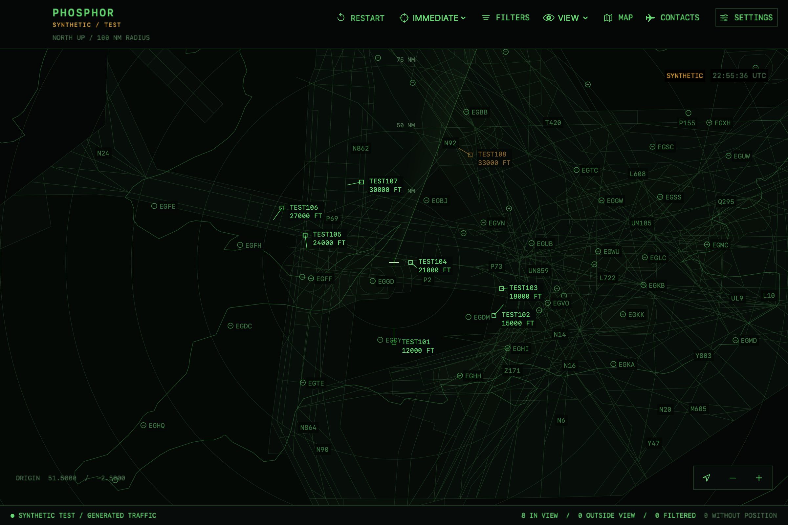

# Phosphor

A native macOS aircraft viewer with a vintage military radar display, inspired by [Air Defender](https://airdefendergame.com/).
Track aircraft from an RTL-SDR receiver, [adsb.fi](https://adsb.fi), or an offline synthetic demo.
Explore aircraft details, trails, and bundled UK airways, airspace, and airports.



[Watch the original 15-second demo: South UK to London](assets/demo/adsb-radar.mp4).
This historical recording shows the former ADSB Radar branding.

## Install the app (recommended)

The signed and notarised application package requires macOS 14 or later and supports Apple Silicon and Intel Macs.
No developer tools are needed.

1. Open the [latest release](https://github.com/mint5auce/phosphor/releases/latest) and download `Phosphor-<version>.zip` from **Assets**.
2. Extract the ZIP and drag **Phosphor.app** into **Applications**.
3. Open Phosphor from Applications.

Future updates are available through **Phosphor > Check for Updates**.
Automatic update preferences are in Settings.

## Get started

In Settings, save your home coordinates and choose a source:

- **Online**: live adsb.fi traffic with internet access; no receiver needed.
- **Local**: an RTL-SDR dongle, antenna, and `readsb` (`brew install readsb`).
- **Local + Online**: both sources in one view.
- **Synthetic**: offline Test or Demo traffic.

Drag to pan, pinch to zoom, and click an aircraft to inspect it.
Use Command-0 to return home.

## Try the offline demo

Quit any running copy, then launch:

```sh
'/Applications/Phosphor.app/Contents/MacOS/Phosphor' --synthetic --scenario demo
```

## Development

To build from source, install Swift 6 developer tools on macOS 14 or later, then run:

```sh
./scripts/build-app.sh
open 'build/Phosphor.app'
```

Use `./scripts/build-app.sh release` for a release build in `build/release/Phosphor.app` and `swift test` to run the tests.
See the [usage guide](docs/usage.md) for settings, receiver setup, and manual checks, or the [product specification](docs/product-spec.md) for the accepted design.
Signed distribution builds, Sparkle updates, and the GitHub release workflow are covered in the [release guide](docs/releasing.md).
Phosphor uses a fresh application identity and does not migrate settings or caches from ADSB Radar.
Historical verification records retain the names and commands used at the time; use this README and the usage guide for current build commands.

Aircraft data: [adsb.fi](https://adsb.fi) ([personal-use API](https://github.com/adsbfi/opendata)).
Map data: [Natural Earth](https://www.naturalearthdata.com/) and [UK aviation / airport sources](docs/airway-verification.md).
