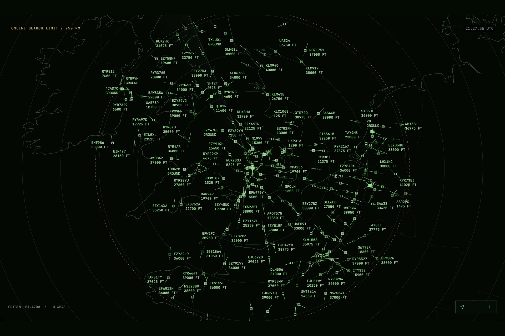

# ADSB Radar

A native macOS aircraft viewer with a vintage military radar display, inspired by [Air Defender](https://airdefendergame.com/).
Track aircraft from an RTL-SDR receiver, [adsb.fi](https://adsb.fi), or an offline synthetic demo.
Explore aircraft details, trails, and bundled UK airways, airspace, and airports.

[](assets/demo/adsb-radar.mp4)

[Watch the 15-second demo: South UK to London](assets/demo/adsb-radar.mp4).

## Build and start

An easy-to-install package for non-developers is coming very soon.
For now, build from source using the instructions below.

Requires macOS 14+ and Swift 6 developer tools.

```sh
./scripts/build-app.sh
open 'build/ADSB Radar.app'
```

In Settings, save your home coordinates and choose a source:

- **Online**: live adsb.fi traffic with internet access; no receiver needed.
- **Local**: an RTL-SDR dongle, antenna, and `readsb` (`brew install readsb`).
- **Local + Online**: both sources in one view.
- **Synthetic**: offline Test or Demo traffic.

Drag to pan, pinch to zoom, and click an aircraft to inspect it.
Use Command-0 to return home.

## Try the offline demo

Quit any running copy, then launch:

```sh
'build/ADSB Radar.app/Contents/MacOS/ADSB Radar' --synthetic --scenario demo
```

## Development

Use `./scripts/build-app.sh release` for a release build and `swift test` to run the tests.
See the [usage guide](docs/usage.md) for settings, receiver setup, and manual checks, or the [product specification](docs/product-spec.md) for the accepted design.

Aircraft data: [adsb.fi](https://adsb.fi) ([personal-use API](https://github.com/adsbfi/opendata)).
Map data: [Natural Earth](https://www.naturalearthdata.com/) and [UK aviation / airport sources](docs/airway-verification.md).
